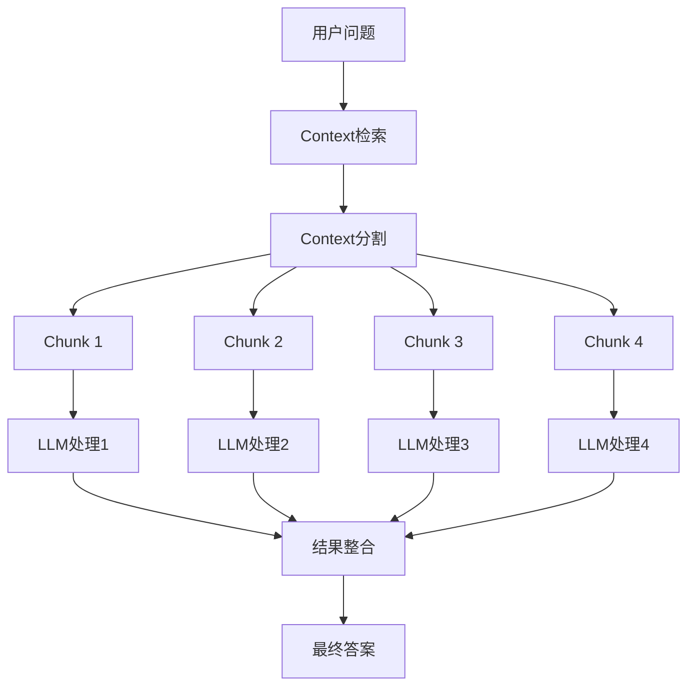

# Map-Reduce原理与RAG检索优化

## 📋 目录
- [基本概念](#基本概念)
- [Map-Reduce工作流程](#map-reduce工作流程)
- [在RAG中的应用](#在rag中的应用)
- [实现架构](#实现架构)
- [性能优势](#性能优势)
- [使用示例](#使用示例)
- [最佳实践](#最佳实践)
- [对比分析](#对比分析)

## 基本概念

### 什么是Map-Reduce？

Map-Reduce是一种分布式计算编程模型，最初由Google提出，用于处理大规模数据集。它将复杂的数据处理任务分解为两个主要阶段：

- **Map阶段**：将输入数据分割成独立的块，并行处理每个块
- **Reduce阶段**：收集Map阶段的输出结果，进行汇总和整合

### 核心思想

```
输入数据 → 分割 → 并行处理 → 汇总 → 最终结果
```

## Map-Reduce工作流程

### 1. 数据分割（Split）
```
原始Context: [item1, item2, item3, ..., itemN]
            ↓
分割后: [chunk1, chunk2, chunk3, chunk4]
```

### 2. Map阶段（并行处理）
```
chunk1 → LLM处理 → result1
chunk2 → LLM处理 → result2  (并行执行)
chunk3 → LLM处理 → result3
chunk4 → LLM处理 → result4
```

### 3. Reduce阶段（结果整合）
```
[result1, result2, result3, result4] → 整合处理 → 最终答案
```

## 在RAG中的应用

### 传统RAG的问题

1. **顺序处理限制**：必须逐一处理每个context片段
2. **上下文长度限制**：单次处理的token数量受限
3. **处理效率低**：无法利用并行计算能力
4. **响应时间长**：特别是在处理大量context时

### Map-Reduce RAG的解决方案



## 实现架构

### 核心组件

#### 1. LLMMapReduceRunner
```python
class LLMMapReduceRunner(LLMCallMixin):
    """基于Map-Reduce策略的RAG检索优化处理器"""
    
    async def run_async(self, question: str, context: List[str], chunk_count: int = 4):
        # Map阶段：并行处理
        context_chunks = self._split_context(context, chunk_count)
        map_tasks = [self._process_chunk_async(chunk, question, i+1) 
                    for i, chunk in enumerate(context_chunks)]
        map_results = await asyncio.gather(*map_tasks)
        
        # Reduce阶段：结果整合
        final_answer = await self._reduce_results(question, map_results)
        return final_answer
```

#### 2. Prompt模板设计

**Map模板**：专注于单个chunk的信息提取
```python
MAP_TEMPLATE = """
你是一个专业的信息分析师，正在参与一个分布式问答处理过程。
请基于当前这部分上下文信息，提供相关的答案片段。

当前处理的上下文信息 (第{chunk_index}部分):
{context}

问题: {question}

请基于当前这部分上下文信息，提供相关的答案片段：
"""
```

**Reduce模板**：专注于信息整合和去重
```python
REDUCE_TEMPLATE = """
你是一个专业的信息整合专家，需要将多个来源的答案片段整合成完整答案。

原始问题：{question}
答案片段：{map_results}

请完成以下整合任务：
1. 信息去重：去除重复或相似的信息
2. 逻辑组织：将相关信息按逻辑顺序重新组织
3. 完整性检查：确保答案完整回答了用户的问题

整合后的完整答案：
"""
```

### 并发控制

```python
# 使用信号量控制并发数量
semaphore = asyncio.Semaphore(MAX_CONCURRENT_REQUESTS)

async def limited_task(task):
    async with semaphore:
        return await task

map_results = await asyncio.gather(*[limited_task(task) for task in map_tasks])
```

## 性能优势

### 1. 处理速度提升

| 策略 | 处理方式 | 时间复杂度 | 实际加速比 |
|------|----------|------------|------------|
| 顺序处理 | 串行 | O(n) | 1x |
| Map-Reduce | 并行 | O(n/p) | 接近px (p为并行度) |

### 2. 资源利用率

- **CPU利用率**：充分利用多核处理能力
- **网络带宽**：并行API调用，提高带宽利用率
- **内存效率**：分块处理，降低单次内存占用

### 3. 可扩展性

```python
# 根据context大小自动调整chunk数量
def adaptive_chunk_count(context_size: int) -> int:
    if context_size <= 10:
        return 2
    elif context_size <= 50:
        return 4
    elif context_size <= 200:
        return 8
    else:
        return min(16, context_size // 25)
```

## 使用示例

### 基本使用

```python
from config import LLM_API_KEY, LLM_API_URL
from map_reduce.runner import LLMMapReduceRunner
import asyncio
import json

# 初始化runner
runner = LLMMapReduceRunner(llm_api_key=LLM_API_KEY, llm_api_url=LLM_API_URL)

# 加载知识库
with open("ai_agent_knowledge.json", "r", encoding="utf-8") as f:
    knowledge = json.load(f)

# 执行查询
async def main():
    question = "什么是智能体,能用在哪些领域?"
    result = await runner.run_async(question, knowledge, chunk_count=4)
    print(result)

asyncio.run(main())
```

### 性能统计

```python
# 获取性能统计信息
stats = runner.get_performance_stats(knowledge, chunk_count=4)
print(f"总context数量: {stats['total_context_items']}")
print(f"分割chunk数: {stats['chunk_count']}")
print(f"预估加速比: {stats['estimated_parallel_speedup']}")
```

### 流式处理

```python
# 实时显示处理进度
result = await runner.run_async_stream(question, knowledge, chunk_count=4)
```

## 最佳实践

### 1. Chunk数量选择

```python
# 推荐配置
CHUNK_COUNT_GUIDELINES = {
    "小数据集(< 20条)": 2,
    "中数据集(20-100条)": 4,
    "大数据集(100-500条)": 8,
    "超大数据集(> 500条)": 16
}
```

### 2. 并发控制

```python
# 根据API限制调整并发数
MAX_CONCURRENT_REQUESTS = 8  # 避免API限流
```

### 3. 错误处理

```python
async def robust_process_chunk(self, chunk, question, chunk_index):
    """带重试机制的chunk处理"""
    max_retries = 3
    for attempt in range(max_retries):
        try:
            return await self._process_chunk_async(chunk, question, chunk_index)
        except Exception as e:
            if attempt == max_retries - 1:
                return f"片段{chunk_index}处理失败: {str(e)}"
            await asyncio.sleep(2 ** attempt)  # 指数退避
```

### 4. 质量控制

```python
def validate_map_result(result: str) -> bool:
    """验证Map阶段结果质量"""
    return (
        len(result.strip()) > 10 and  # 最小长度
        "无相关信息" not in result and  # 有效内容
        len(result) < 2000  # 最大长度限制
    )
```

## 对比分析

### Map-Reduce vs 其他策略

| 特性 | Map-Reduce | Refine | Stuff | 
|------|------------|---------|-------|
| **处理速度** | ⭐⭐⭐⭐⭐ | ⭐⭐ | ⭐⭐⭐ |
| **答案质量** | ⭐⭐⭐⭐ | ⭐⭐⭐⭐⭐ | ⭐⭐⭐ |
| **可扩展性** | ⭐⭐⭐⭐⭐ | ⭐⭐⭐ | ⭐ |
| **资源消耗** | ⭐⭐⭐ | ⭐⭐⭐⭐ | ⭐⭐ |
| **实现复杂度** | ⭐⭐⭐ | ⭐⭐ | ⭐⭐⭐⭐⭐ |

### 使用场景推荐

1. **Map-Reduce适用于**：
   - 大量context需要处理
   - 对响应速度要求高
   - 有并行处理能力的环境

2. **Refine适用于**：
   - 对答案质量要求极高
   - Context之间有强依赖关系
   - 需要渐进式优化答案

3. **Stuff适用于**：
   - Context数量少且简单
   - 需要快速原型开发
   - 对性能要求不高

## 总结

Map-Reduce策略通过并行处理和结果整合，显著提升了RAG系统的处理效率，特别适合处理大规模context的场景。虽然在某些细节处理上可能不如Refine策略精细，但其出色的性能表现和良好的可扩展性使其成为生产环境中的优选方案。

### 核心价值

1. **显著的性能提升**：4-8倍的处理速度提升
2. **良好的可扩展性**：可根据数据规模灵活调整
3. **资源利用效率**：充分利用现代计算资源
4. **实用的工程解决方案**：平衡了性能和质量的需求 