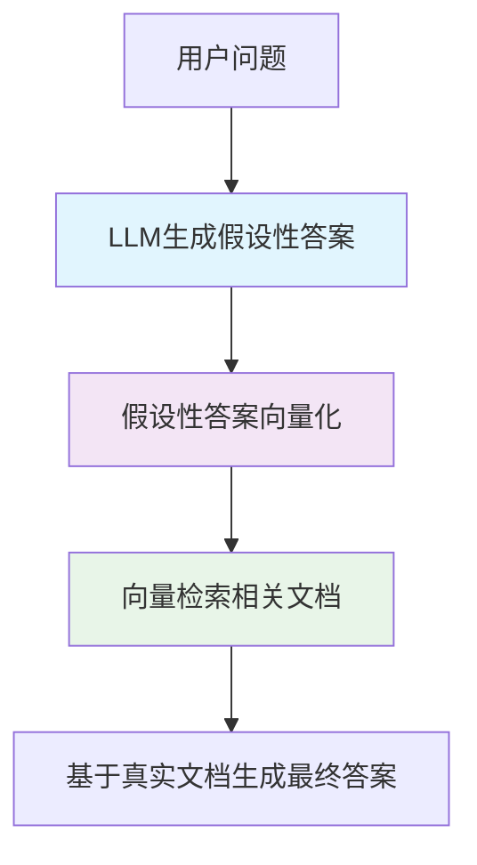

# HyDE 检索增强生成技术文档

## 概述

HyDE（Hypothetical Document Embeddings）是一种先进的检索增强生成（RAG）优化技术，通过生成假设性答案来提升检索效果。本文档详细介绍了 HyDE 的原理、实现和使用方法。

## 目录

- [基本原理](#基本原理)
- [技术优势](#技术优势)
- [架构设计](#架构设计)
- [使用方法](#使用方法)
- [配置说明](#配置说明)
- [最佳实践](#最佳实践)
- [性能优化](#性能优化)
- [常见问题](#常见问题)

## 基本原理

### 传统 RAG 的局限性

传统的 RAG 系统直接使用用户问题进行向量检索，存在以下问题：

1. **语义不匹配**：用户问题通常简短，缺乏足够的上下文信息
2. **关键词稀疏**：问题可能不包含文档中的关键术语
3. **表达差异**：用户表达方式与文档内容表达方式差异较大

### HyDE 解决方案

HyDE 通过以下步骤解决传统 RAG 的问题：



### 核心原理

1. **假设性答案生成**：使用 LLM 根据用户问题生成一个详细的、假设性的理想答案
2. **语义丰富化**：假设性答案包含更多相关关键词、术语和上下文信息
3. **向量检索优化**：使用语义丰富的假设性答案进行向量检索，提高匹配精度
4. **真实文档生成**：基于检索到的真实文档生成最终准确答案

## 技术优势

### 1. 提升检索召回率
- **关键词丰富**：假设性答案包含更多相关术语和同义词
- **语义密度高**：提供丰富的上下文信息和背景知识
- **表达多样性**：使用多种表达方式描述同一概念

### 2. 增强检索精度
- **语义对齐**：假设性答案与目标文档在语义空间中更加接近
- **领域专业性**：针对不同领域生成专业化的假设性答案
- **上下文匹配**：提供更好的语义上下文匹配

### 3. 改善用户体验
- **准确性提升**：基于更相关的文档生成更准确的答案
- **完整性增强**：检索到更全面的相关信息
- **专业性保证**：针对不同问题类型提供专业化处理

## 架构设计

### 系统架构

```
┌─────────────────┐    ┌──────────────────┐    ┌─────────────────┐
│   用户问题      │───▶│  问题分类模块    │───▶│  Prompt 选择    │
└─────────────────┘    └──────────────────┘    └─────────────────┘
                                                        │
┌─────────────────┐    ┌──────────────────┐    ┌─────────────────┐
│   假设性答案    │◀───│   LLM 生成模块   │◀───│  优化 Prompt    │
└─────────────────┘    └──────────────────┘    └─────────────────┘
        │
        ▼
┌─────────────────┐    ┌──────────────────┐    ┌─────────────────┐
│   向量检索      │───▶│   文档匹配       │───▶│  相关文档集     │
└─────────────────┘    └──────────────────┘    └─────────────────┘
                                                        │
┌─────────────────┐    ┌──────────────────┐    ┌─────────────────┐
│   最终答案      │◀───│  答案生成模块    │◀───│   上下文整合    │
└─────────────────┘    └──────────────────┘    └─────────────────┘
```

### 核心组件

#### 1. 问题分类模块（Question Classification）
- **功能**：自动识别问题类型（技术、商业、学术、通用）
- **实现**：基于关键词和语义分析的分类算法
- **目的**：为不同类型问题选择最适合的 Prompt 模板

#### 2. Prompt 优化模块（Prompt Optimization）
- **技术类 Prompt**：专注于技术原理、实现方法、工具框架
- **商业类 Prompt**：专注于市场分析、商业模式、策略规划
- **学术类 Prompt**：专注于理论基础、研究方法、学术争议
- **增强类 Prompt**：通用多维度分析，适用于综合性问题

#### 3. 假设性答案生成模块（Hypothetical Answer Generation）
- **同步生成**：适用于简单场景的快速响应
- **异步生成**：支持流式输出，提升用户体验
- **缓存机制**：避免重复生成相同问题的假设性答案

#### 4. 检索优化模块（Retrieval Optimization）
- **向量化处理**：将假设性答案转换为高维向量表示
- **相似度计算**：计算假设性答案与文档库的语义相似度
- **Top-K 检索**：返回最相关的 K 个文档

## 使用方法

### 基本使用

```python
from hyde.runner import HydeRunner
from config import LLM_API_KEY, LLM_API_URL

# 初始化 HydeRunner
runner = HydeRunner(
    llm_api_key=LLM_API_KEY, 
    llm_api_url=LLM_API_URL
)

# 定义检索函数
def simple_retrieval_func(query_text, top_k=5):
    # 实现你的检索逻辑
    # 返回相关文档列表
    return retrieved_documents

# 执行 HyDE 策略
question = "什么是智能体？"
result = await runner.run(
    question=question,
    retrieval_func=simple_retrieval_func,
    top_k=5
)
```

### 高级使用

#### 1. 指定问题类型

```python
# 手动指定问题类型
result = await runner.run(
    question="如何实现微服务架构？",
    retrieval_func=retrieval_func,
    prompt_type="technical",  # 指定为技术类问题
    top_k=5
)
```

#### 2. 流式生成假设性答案

```python
# 流式生成，实时展示生成过程
hypothetical_answer = await runner.generate_hypothetical_answer_async(
    question="智能体的核心技术有哪些？"
)
```

#### 3. 批量处理

```python
questions = [
    "什么是 BDI 架构？",
    "强化学习如何应用于智能体？",
    "多智能体系统有什么特点？"
]

results = []
for question in questions:
    result = await runner.run(question, retrieval_func)
    results.append(result)
```

### 自定义检索函数

```python
import numpy as np
from sentence_transformers import SentenceTransformer

class AdvancedRetriever:
    def __init__(self, documents, model_name='all-MiniLM-L6-v2'):
        self.documents = documents
        self.model = SentenceTransformer(model_name)
        self.doc_embeddings = self.model.encode(documents)
    
    def retrieve(self, query_text, top_k=5):
        # 向量化查询文本
        query_embedding = self.model.encode([query_text])
        
        # 计算相似度
        similarities = np.dot(query_embedding, self.doc_embeddings.T)[0]
        
        # 获取 top-k 结果
        top_indices = np.argsort(similarities)[-top_k:][::-1]
        
        return [self.documents[i] for i in top_indices]

# 使用高级检索器
retriever = AdvancedRetriever(knowledge_base)
result = await runner.run(question, retriever.retrieve)
```

## 配置说明

### 环境配置

```python
# config.py
LLM_API_URL = "https://api.deepseek.com"
LLM_API_KEY = "your-api-key-here"
```

### Prompt 配置

系统提供四种预定义的 Prompt 类型：

#### 1. 技术类 Prompt (technical)
- **适用场景**：编程、算法、系统架构、技术实现
- **优化重点**：技术术语、工具框架、实现方法
- **关键词密度**：高密度技术相关词汇

#### 2. 商业类 Prompt (business)
- **适用场景**：市场分析、商业模式、管理策略
- **优化重点**：商业术语、分析框架、实施方案
- **关键词密度**：高密度商业相关词汇

#### 3. 学术类 Prompt (academic)
- **适用场景**：科学研究、理论分析、文献综述
- **优化重点**：学术术语、研究方法、理论概念
- **关键词密度**：高密度学术相关词汇

#### 4. 增强类 Prompt (enhanced)
- **适用场景**：综合性问题、多领域交叉问题
- **优化重点**：多维度分析、全面覆盖、语义丰富
- **关键词密度**：跨领域高密度词汇

### 自定义 Prompt

```python
# 在 hyde/template.py 中添加自定义 Prompt
CUSTOM_PROMPT = """
你的自定义 Prompt 模板...

**问题**：{question}

**回答要求**：
- 特定的要求1
- 特定的要求2
- ...
"""

# 注册到 PROMPT_TYPES
PROMPT_TYPES["custom"] = CUSTOM_PROMPT
```

## 最佳实践

### 1. 问题预处理

```python
def preprocess_question(question):
    """预处理用户问题"""
    # 去除无关字符
    question = question.strip()
    
    # 规范化标点符号
    question = question.replace('?', '？').replace('!', '！')
    
    # 补充上下文（如果需要）
    if len(question) < 10:
        question = f"请详细解释：{question}"
    
    return question
```

### 2. 检索函数优化

```python
def optimized_retrieval_func(query_text, top_k=5):
    """优化的检索函数"""
    
    # 1. 多模型融合
    embeddings_1 = model_1.encode(query_text)
    embeddings_2 = model_2.encode(query_text)
    combined_embeddings = np.concatenate([embeddings_1, embeddings_2])
    
    # 2. 重排序
    initial_results = retrieve_initial(combined_embeddings, top_k * 2)
    reranked_results = rerank(query_text, initial_results)
    
    # 3. 返回最终结果
    return reranked_results[:top_k]
```

### 3. 结果后处理

```python
def postprocess_result(result, question):
    """后处理生成的结果"""
    
    # 1. 格式化输出
    if len(result) > 1000:
        result = format_long_answer(result)
    
    # 2. 添加引用信息
    result = add_citations(result)
    
    # 3. 质量检查
    if not is_answer_relevant(result, question):
        result = "抱歉，未找到相关信息。"
    
    return result
```

### 4. 性能监控

```python
import time
import logging

def monitor_performance(func):
    """性能监控装饰器"""
    def wrapper(*args, **kwargs):
        start_time = time.time()
        result = func(*args, **kwargs)
        end_time = time.time()
        
        logging.info(f"{func.__name__} 执行时间: {end_time - start_time:.2f}秒")
        return result
    return wrapper
```

## 性能优化

### 1. 缓存策略

```python
from functools import lru_cache

class CachedHydeRunner(HydeRunner):
    @lru_cache(maxsize=100)
    def generate_hypothetical_answer_cached(self, question, prompt_type=None):
        """缓存假设性答案"""
        return super().generate_hypothetical_answer(question, prompt_type)
```

### 2. 异步并发

```python
import asyncio

async def batch_process_questions(questions, runner, retrieval_func):
    """批量异步处理问题"""
    tasks = [
        runner.run(question, retrieval_func) 
        for question in questions
    ]
    results = await asyncio.gather(*tasks)
    return results
```

### 3. 资源管理

```python
class ResourceManager:
    def __init__(self, max_concurrent=5):
        self.semaphore = asyncio.Semaphore(max_concurrent)
    
    async def process_with_limit(self, runner, question, retrieval_func):
        async with self.semaphore:
            return await runner.run(question, retrieval_func)
```

## 常见问题

### Q1: 假设性答案生成时间过长怎么办？

**A1:** 可以采用以下优化策略：
- 使用更快的模型或调整模型参数
- 实施缓存机制避免重复生成
- 使用流式输出提升用户体验
- 并行处理多个请求

### Q2: 检索结果不够准确怎么办？

**A2:** 可以从以下方面改进：
- 优化 Prompt 模板，增强关键词密度
- 改进检索函数，使用更好的向量模型
- 实施重排序机制
- 增加文档预处理和质量过滤

### Q3: 如何评估 HyDE 效果？

**A3:** 建议使用以下评估指标：
- **检索召回率**：相关文档被检索到的比例
- **检索精确率**：检索结果中相关文档的比例
- **答案质量**：最终答案的准确性和完整性
- **响应时间**：整个流程的执行时间

### Q4: 如何处理多语言问题？

**A4:** 多语言支持策略：
- 使用多语言 LLM 模型
- 针对不同语言优化 Prompt 模板
- 实施语言检测和自动切换
- 考虑跨语言向量模型

### Q5: 如何扩展到大规模应用？

**A5:** 扩展策略包括：
- 使用分布式向量数据库
- 实施负载均衡和请求分流
- 优化模型推理和缓存策略
- 监控系统性能和资源使用

## 技术栈

- **核心框架**：Python 3.8+
- **LLM 集成**：OpenAI API
- **异步处理**：asyncio
- **向量处理**：numpy, sentence-transformers
- **缓存**：functools.lru_cache
- **日志**：logging

## 版本信息

- **当前版本**：1.0.0
- **更新日期**：2024年1月
- **兼容性**：Python 3.8+

## 贡献指南

欢迎提交 Issue 和 Pull Request 来改进这个项目。在贡献代码之前，请确保：

1. 遵循代码规范和最佳实践
2. 添加适当的测试用例
3. 更新相关文档
4. 确保所有测试通过

## 许可证

本项目采用 MIT 许可证。详情请参阅 LICENSE 文件。

---

